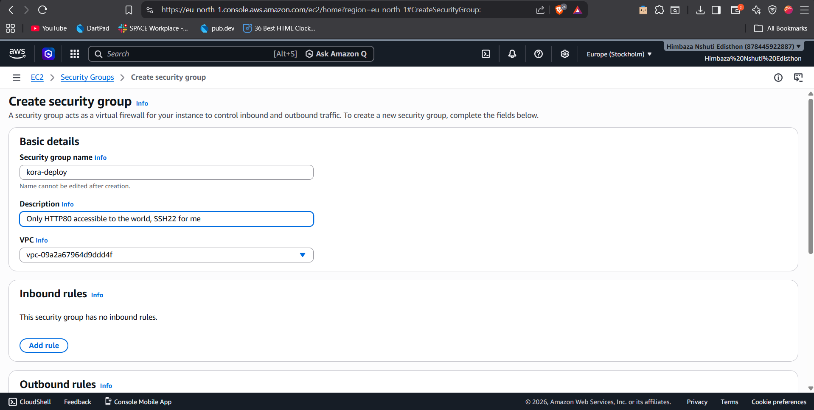
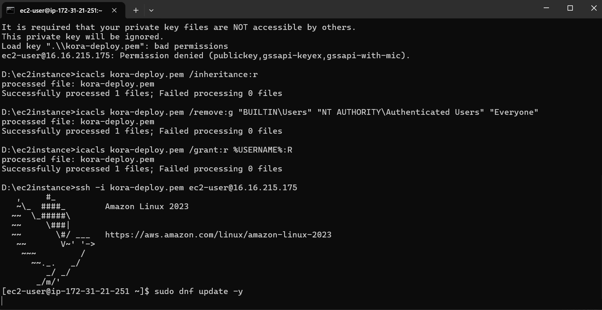
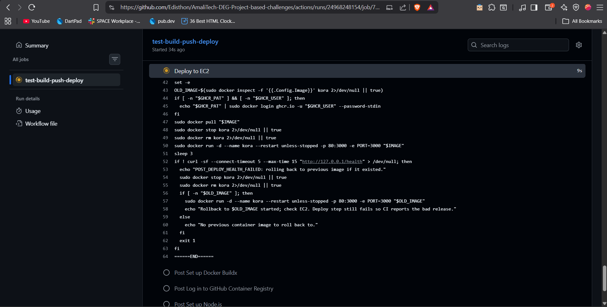

# Kora API — how I deployed it

Notes on EC2, the GitHub Action, and a few things I had to fix. I’m on **AWS (EC2, Amazon Linux 2023, `t2.micro`)**; the track allows other providers, I picked AWS to stay aligned with the example and because the free tier was enough for this.

---

## 1. Stack overview

| Part | What I did |
|------|------------|
| Dockerfile | `node:20-alpine`, non-root user, `PORT` for the app |
| docker-compose | Local: map 3000, env from `.env` |
| GitHub Actions | On `main`: `npm test` → build+push to **GHCR** (tag = commit SHA) → SSH to the box → `docker pull` and restart `kora` on **80 → 3000**; on failure after deploy, rollback to the previous image (optional bonus) |
| EC2 | Single container, same port mapping as above |

**GHCR** — GitHub’s registry; the workflow uses `GITHUB_TOKEN` to push. The server pulls the image; if the package is private, I used a PAT in secrets for the pull.

**Security group** — I allowed **80** from anywhere for the app, and **22** from my IP and from GitHub’s `actions` ranges (see [api.github.com/meta](https://api.github.com/meta)) so the workflow can SSH, not from `0.0.0.0/0`.

**Tags** — image tag = Git SHA so I can see exactly what’s running.

**Rollback** — after a new container starts, the script curls `http://127.0.0.1/health`. If that fails, it tries to go back to the last image. The Action still fails so I don’t get a green build on a bad release.

A typical run in the **Actions** tab (test → build/push to GHCR → deploy over SSH):


---

## 2. EC2

- **Region:** (mine: e.g. `eu-west-1`)
- **AMI:** Amazon Linux 2023
- **Type:** `t2.micro` (or `t3.micro` if `t2` isn’t there)
- **Key pair:** created in the console, `.pem` kept only on my machine — not in the repo
- **Public IPv4** so `http://<ip>/health` is reachable
- **IAM on the instance:** I didn’t need AWS access keys in GitHub for the deploy (images go to GHCR, not ECR). I added a note for any instance profile I attached: _(optional — describe yours if you added one)_

---

## 3. Security group

| Port | Inbound from | Notes |
|------|--------------|--------|
| 80 | 0.0.0.0/0 | HTTP / `/health` |
| 22 | your IP + GitHub `actions` CIDRs, not 0.0.0.0/0 | SSH for me and for `appleboy/ssh-action` |

Outbound: default (all) is fine for `docker pull` and DNS.



---

## 4. IAM and the “pipeline user” ask

Pushing the image is done by GitHub (`GITHUB_TOKEN` with `packages: write`), not an IAM user in my AWS account for that step.

To cover the “least-privilege identity” part, I described what I actually use: e.g. an **instance role** on the VM if I added SSM, or a separate operator user **without** keys stored in the repo. **What I used:** _(one line: e.g. no extra beyond default, or instance profile for X)_

---

## 5. Docker on the instance (Amazon Linux 2023)

```bash
sudo dnf update -y
sudo dnf install -y docker
sudo systemctl enable --now docker
sudo usermod -aG docker ec2-user
```

The deploy script uses `sudo docker` so it still works if the shell session doesn’t have the `docker` group yet.

---

## 6. GitHub repo secrets

These are the variable **names**; values live in GitHub only.

| Name | What it’s for |
|------|----------------|
| `EC2_HOST` | Public IP or DNS |
| `EC2_USER` | `ec2-user` in my case |
| `EC2_SSH_KEY` | Private key (PEM) |
| `GHCR_PAT` / `GHCR_USER` | Only if the GHCR package is private |

If the `kora-api` image is public on GHCR, I didn’t need a PAT for pull.

---

## 7. First time on the box (manual, optional)

```bash
export IMAGE=ghcr.io/<owner>/<repo>/kora-api:<commit-sha>
sudo docker pull "$IMAGE"
sudo docker run -d --name kora --restart unless-stopped -p 80:3000 -e PORT=3000 "$IMAGE"
```

After that, each green push to `main` does the same through the Action.

---

## 8. Checking it

**On the server**

```bash
sudo docker ps --filter name=kora
```

You should see `0.0.0.0:80->3000/tcp` (or similar).

SSH into the host; then you can run `docker` like below.




**From my laptop**

- `http://<public-ip>/health` → `{"status":"ok"}` — use this for the “deployed application” link in the submission form.
- `http://<public-ip>/metrics` → JSON with `uptime_seconds`, `memory_mb`, `node_version` (same as local `http://localhost:3000/metrics` when the app is on 3000)
- `http://<public-ip>/` (root) → there is no `GET /` route in the app, so you will see *Cannot GET /*; that is normal, not a failed deploy.

Quick check:

```bash
curl -s "http://<public-ip>/metrics"
```

**Logs**

```bash
sudo docker logs kora
sudo docker logs -f kora
```

---

## 9. Bonus: rollback in the pipeline

I kept the last running image name before replacing the container, started the new one, then:

`curl -sf http://127.0.0.1/health`

If that fails, the script stops the new container and brings back the previous image when there was one. The workflow step still **exits 1** so the run is red and I can see the failure.

### How I tested it

I needed a case where **tests pass** but the **container** is wrong, so the bad image actually gets deployed. Changing only `app/index.js` usually fails `npm test`, so the deploy never runs. I made a **temporary** change to the **Dockerfile** (e.g. a `CMD` that doesn’t start Node on 3000) and pushed. The test job went green, the new image deployed, the health check failed, I saw the rollback message in the deploy log, and the job was red. Then I reverted the Dockerfile and pushed a clean build.

**What I learned** — post-deploy health caught something unit tests didn’t, rollback brought service back, and the failed run in Actions still shows up for the bad commit.

Example of what showed in the **Deploy to EC2** log when health failed and the script rolled back:



---

## 10. Problems I hit

| What I saw | What it usually was | Fix |
|------------|---------------------|-----|
| SSH timeout from Actions | Port 22 not open for the runner’s network | Add GitHub `actions` ranges from the meta API (I tightened from a wider rule once it worked) |
| `unknown blob` on push to GHCR | BuildKit attestations with `docker push` | `docker buildx build --provenance=false --sbom=false --push` in one go |
| `no key found` in Actions | `EC2_SSH_KEY` secret wrong | Full PEM, one block, newlines preserved |
| `docker ps` empty on EC2 | No successful deploy or pull error | Check workflow, `EC2_HOST`, and GHCR auth |

When the **Deploy to EC2** step could not connect (e.g. SSH/SG or secrets), the run looked like this until I fixed the rules and the secret:


*(`VPC_Architecture.png` in `assets` is the InfraBlueprint Terraform diagram, not this single-EC2 path — see that module’s README.)*

---

## 11. Quick reference (marking / demo)

- **Health URL:** `http://<public-ip>/health` — replace with my instance
- **Image:** `ghcr.io/.../kora-api:<git-sha>`
- **Rollback in pipeline:** yes (curl after deploy, revert to previous image on fail)
- **Rollback test:** yes — Dockerfile-only bad deploy, then revert (see section 9)

This file is part of the submission write-up. It doesn’t include secrets; keys and tokens only exist in GitHub and on my machine.
